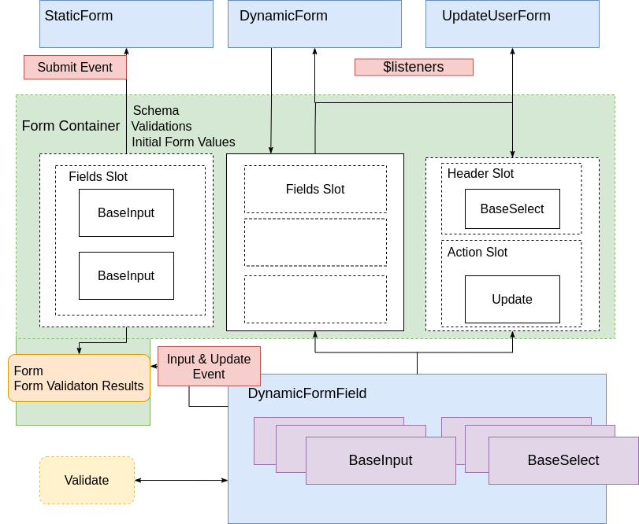

[CodeSandbox](https://codesandbox.io/s/friendly-satoshi-33yj7)

> Open console to view form payloads.

## Overview

```
.
├── package.json
├── public
│   ├── favicon.ico
│   └── index.html
├── README.md
└── src
    ├── App.vue // root component
    ├── components
    │   ├── base
    │   │   ├── BaseInput.vue
    │   │   └── BaseSelect.vue
    │   ├── BasicForm.vue
    │   ├── DynamicFormField.vue
    │   └── UpdateUserForm.vue
    ├── containers
    │   └── FormContainer.vue
    ├── data
    │   ├── mainFormSchema.json
    │   ├── secondFormSchema.json
    │   └── users.js
    ├── main.js
    ├── mixins
    │   └── validation.js // used to provide validation functionality
    └── utils
        ├── schemaParser.js
        └── validators.js  // validators used by validation mixin
```



## Component Communication


Communication between components sending props from parent to child and emitting events and subsequent data changes using `$emit`.

In the props-down and events-up pattern, the parent component’s data object is the single source of truth for the whole application. Child components should receive data from the parent’s data object via props — “props-down”. And parent component should update its state by handling events emitted from child components — “events-up”.

 in this case acting as the root component holding the state and source of truth.

The the form value state is held in `form` and the state of validations against the form in `formValidations`.

```js
 data() {
    return {
      form: {},
      formValidations: {},
    };
  },
```

These values are updated on `input` events via `v-model=form[name]` and `update` events handled in `onValueUpdate`. You can read more about how v-model works [here](https://vuejs.org/v2/guide/forms.html).

Note the use of `v-on="$listeners"` in each usage of `FormContainer`. This technique allows for the listeners from `DynamicForm` and `UpdateUserForm` (the parent) to be applied to `FormContainer` (the child). In this case the only listener is the `submit` event, which is transparently passed from `FormContainer` to the parent component.

Any event can be passed from the child to the parent for example:

```html
<DynamicForm @error="onError" @submit="submitDynamicForm" />
```

Here, `onError` would be triggered if `FormContainer` emitted an "error" event like so `$emit('error', value)`, any custom or [DOM event](https://vuejs.org/v2/guide/events.html) from a child can be listened to by the parent using `v-on="$listeners"` without explicitly passing that event from child to parent.

However, as we are only listening to the `submit` event, the same result can be achieved by explicitly emitting the event up the component tree like so (as seen in `StaticForm`):

```html
<FormContainer @submit="$emit('submit', $event)">
  ....
</FormContainer>
```

> v-on="$listeners" is similar in concept to [$attrs](https://vuejs.org/v2/api/#vm-attrs). So much so they are combined them in [Vue 3](https://v3.vuejs.org/guide/migration/listeners-removed.html). They are powerful parts of Vue's API but like slots and dynamic components can be a little abstract initially.

## Form Layout

The form layout can be cutomised using [named slots](https://vuejs.org/v2/guide/components-slots.html#Named-Slots). Default values are provided in the `field` by using the `DynamicFormField` component for each element in the schema and `action` slots which must be a button of type `submit` in order to trigger the submit handler, there is an optional `header` layout used in `UpdateUserForm`.

## Dynamic Form Field

Dynamic fields are generated using vues [dynamic component](https://vuejs.org/v2/guide/components-dynamic-async.html) functionality. The component name is setup in [schemaParser.js](./src/utils/schemaParser.js) and dynamically imported and returned in the a [computed property](https://vuejs.org/v2/api/#computed) of [DynamicFormField](./src/components/DynamicFormField.vue)

## Validations

Validations are dynamically assigned to fields via `createValidations` found [here](./src/utils/validators.js:1), those validations are then applied via a [mixin](https://vuejs.org/v2/api/#mixins). The application and interface to apply validations is largely inspired by [vuelidate](https://vuelidate.js.org/).

## Submitting a form

When the "action" button is clicked it will trigger form validation which checks each value in the `formValidations` state and ensures that all have passed. The initial formValidations are setup in the `created` [lifecycle hook](https://vuejs.org/v2/guide/instance.html#Instance-Lifecycle-Hooks) of the `DynamicFormField`.

The `submit` event is emitted on form submition using [@submit.prevent](./src/containers/FormContainer.vue),note the use of the `.prevent` [modifier](https://vuejs.org/v2/guide/syntax.html#Modifiers) which prevents the default action of the form allowing the event to be handled in the `onSubmit` method.

## Pre-populating a form

Using the `header` slot to add in a `BaseSelect` component to allow for selection of a user from a list which is generated by [faker](https://github.com/marak/Faker.js/). Once a user is selected the values are used to provide `initialFormValues` which are applied to the `form` data. The `initialFormValues` prop is [watched](https://vuejs.org/v2/api/#watch) in `FormContainer` and applied on to `form` state on value change.

## References

[Vue 2 Forms](https://github.com/PacktPublishing/Building-Forms-with-Vue.js)

[Vuelidate](https://github.com/vuelidate/vuelidate)

[Dynamic Schema Validation](https://github.com/marina-mosti/dynamic-schema-vuelidate)

## Further Reading

[Vue 2 Forms](https://www.packtpub.com/product/building-forms-with-vue-js/9781839213335)

[Vue Component Patterns](https://leanpub.com/vuejscomponentpatterns)
